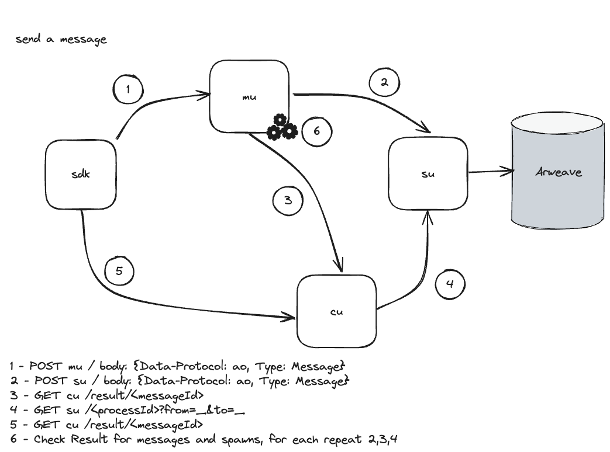

# aos

## Requirements

* [NodeJS](https://nodejs.org) version 20+

## Getting Started

```sh
npm i -g https://get_ao.g8way.io && aos
```

> NOTE: after the first time you run `aos` it installs it to your local machine, so the next time you want to run `aos`, just type `aos` + [enter]

## About

aos is a command-line app that connects to your `aos` Process on the ao Permaweb Computer Grid. The ao Computer Grid, is like the internet, but for compute. Each Process on the Grid can receive messages and send messages. This cli will allow you to pass LUA expressions to your Process, and those expressions get evaluated and return output to your system.  

## Examples

When you boot up the aos, you can use https://lua.org to run expressions on your `aos` Process.

First try "Hello aos" - the return keyword sets the output variable that is passed to the output on the screen.

```lua
"Hello aos"
```

You should get `Hello aos`

> What is happening here? Your input, is getting wrapped in an signed `ao` message and submitted to a messenger unit, which then forwards it to a Scheduler Unit, then the app, calls a compute unit to evaluate the `ao` Message with your Process. This generates output to be returned for display.



Lets try another expression:

```lua
1 + 41
```

You should get `42` the answer to the universe 😛

So, thats cool, you can send expressions to the `ao` Permaweb Computer to your Process, and you get returned a response.

You `aOS` process also has memory, so you can set `variables`

```lua
a = "Hello aos"
```

Then type `return a` and you should get `Hello aos`, neat

You can also create functions:

```lua
sayHi = function (name) return "Hello " .. name end
return sayHi("Sam")
```

You should get `Hello Sam`

Woohoo! 🚀

We can also pass messages to other `aos` Processes!

```lua
send({ Target = "ohc9mIsNs3CFmMu7luiazRDLCFpiFJCfGVomJNMNHdU", Tags = { body = "ping" } })
```

Check the number of items in your `inbox`:

```
#inbox
```

Check the body Tag of the last message in your inbox:

```
inbox[#inbox].Data
```

> Should be `pong` 

Or you can check your messages by typing `inbox`

```lua
inbox
```

### Prompt

Want to customize your `prompt`, all you have to do is to overwrite the `prompt` function

```lua
function prompt() return "🐶> " end
```

Nice, you should see your new prompt.


### handlers

With `aos` you can add handlers to handle incoming messages, in this example, we will create a handler for "ping" - "pong".

In the `aos`, type `.editor`

```lua
handlers.add(
  "pingpong",
  handlers.utils.hasMatchingData("ping"),
  handlers.utils.reply("pong")
)
```

Then type `.done`

>  This will submit a handler to listen for messages that have a `body` tag with a value of `ping` then send back a message `pong`.

Once added you can ping yourself!

```lua
send({Target = ao.id, Data = "ping" })
```

And check your inbox, you should have gotten a `pong` message.

this utility function finds the `body` Tag of the last message in the inbox and returns the `value`

```lua
inbox[#inbox].Data
```

You should see `pong` 

:tada:

For more information about `handlers` check out the handlers [docs](process/handlers.md) 

## Chatroom 

Let's create a chatroom Process, with this chatroom, we want processes to be able to `Register` and `Broadcast` Actions. In order to create this Process, we will use an external editor to create a `chatroom.lua` file. Then use the `.load` feature to update our Process.

chatroom.lua

```lua
if not weavers then
  weavers = {}
end

handlers.add(
  "register", 
  handlers.utils.hasMatchingTag("Action", "Register"),
  function (msg) 
    table.insert(weavers, msg.From)
    -- reply letting process know they are registered
    handlers.utils.reply("registered")(msg)
  end
)

handlers.add(
  "broadcast",
  handlers.utils.hasMatchingTag("Action", "Broadcast"),
  function (msg)
    for index, recipient in ipairs(weavers) do
      ao.send({Target = recipient, Data = msg.Data})
    end
    handlers.utils.reply("Broadcasted.")(msg)
  end

)
```

Now, that we have our handlers, let's load them into our process:

```lua
.load chatroom.lua
```

Sweet! You can test on `aos`

```lua
send({Target = ao.id, Tags = { Action = "Register" }})
```

```lua
weavers[#weavers]
```

You should see your address

Now, lets broadcast!

```lua
send({Target = ao.id, Tags = { Action = "Broadcast" }, Data = "gm"})
```

lets dump the inbox to see all the data.

```lua
dump(inbox)
```

Ok, now get some friends to send some messages to your process.

Once we have confirmed it is working, maybe we do not want to broadcast a message to ourself? 

Lets edit the `chatroom.lua` file in the `Broadcast` function to skip the sender.

```lua
handlers.add(
  "broadcast",
  handlers.utils.hasMatchingTag("Action", "Broadcast"),
  function (msg)
    for index, recipient in ipairs(weavers) do
      -- skip message sender
      if recipient ~= msg.From then
       ao.send({Target = recipient, Data = msg.Data})
      end
    end
    handlers.utils.reply("Broadcasted.")(msg)
  end

)
```

## Token

Let's also make our Process a token, create a `token.lua` file and add this lua expression:

```lua
if not balances then
  balances = {}
end

if not name then
  name = "[your handle] Coin"
end

if not token then
  token = "[symbol]"
end

if not logo then
  logo = "[TXID of your logo]"
end

if not denomination then
  denomination = 6
end

handlers.add(
  "info",
  handlers.utils.hasMatchingTag("Action", "Info"),
  function (msg) 
    ao.Output = {
      Name = name,
      Token = token,
      Denomination = denomination
    }
  end
)

handlers.add(
  "balance",
  handlers.utils.hasMatchingTag("Action", "Balance"),
  balance
)

handlers.add(
  "balances",
  handlers.utils.hasMatchingTag("Action", "Balances"),
  function (msg)
    ao.Output = balances
  end
)

handlers.add(
  "transfer",
  handlers.utils.hasMatchingTag("Action", "Transfer"),
  transfer
)

function transfer(msg) 
  assert(msg.Tags.Target, 'Target is required!')
  assert(msg.Tags.Quantity, 'Quantity is required!')
  local qty = tonumber(msg.Tags.Quantity)
  if balances[msg.From] > qty then
    balances[msg.From] = balances[msg.From] - qty
    balances[msg.Tags.Target] = balances[msg.Tags.Target] + qty
    -- How will the mu know the difference from a wallet and a process?
    ao.send({
      Target = msg.Tags.Target,
      Tags = {
        Action = "Credit-Notice",
        Quantity = msg.Tags.Quantity
      }
    })
    if not msg.Tags.Cast then
      ao.send({
        Target = msg.From,
        Tags = {
          Action = "Debit-Notice",
          Quantity = msg.Tags.Quantity
        }
      })
    end
  end
end

function balance(msg)
  local bal = balances[msg.Tags.Target]
  if not bal then
    bal = 0
  end
  ao.Output = {
    Balance = bal,
    Target = msg.Tags.Target
  }
end
```

```lua
.load token.lua
```

BAM! We just converted our Process to a Token on aos... 🤯

## Summary

Hopefully, you are able to see the power of aos in this demo, access to compute from anywhere in the world. 

Welcome to the `ao` Permaweb Computer Grid! We are just getting started! 🐰
